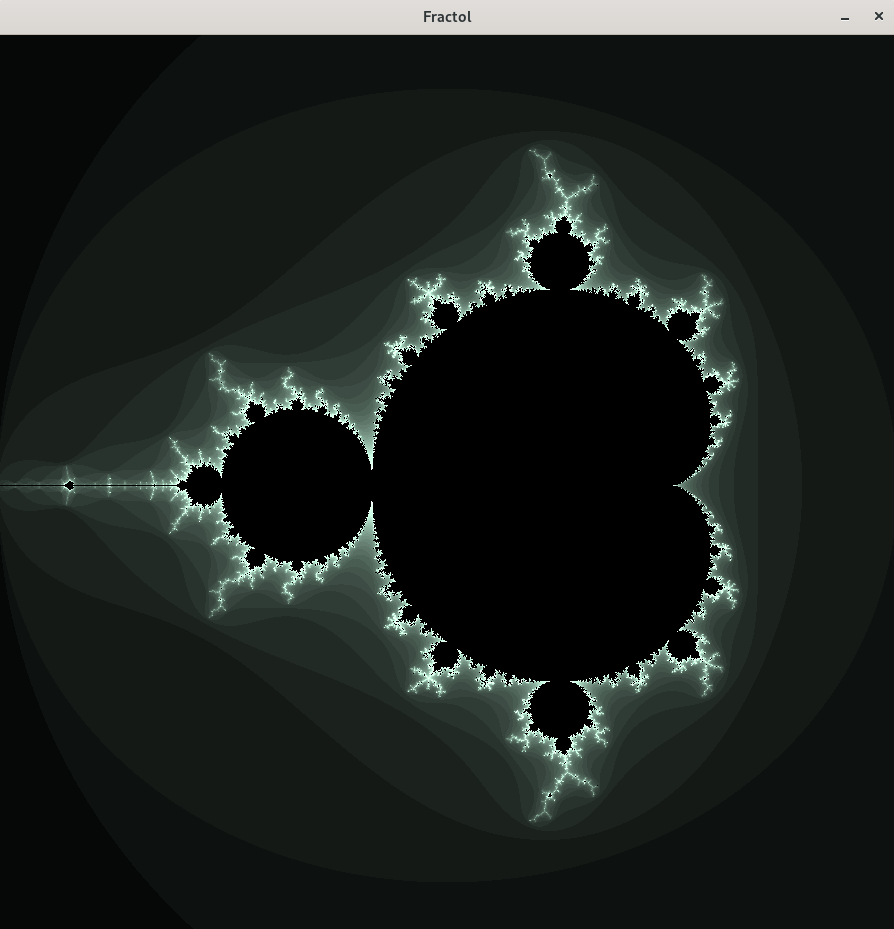
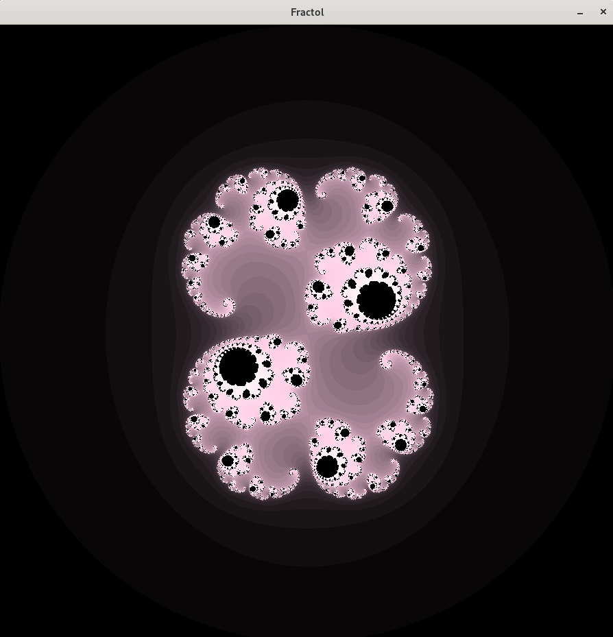
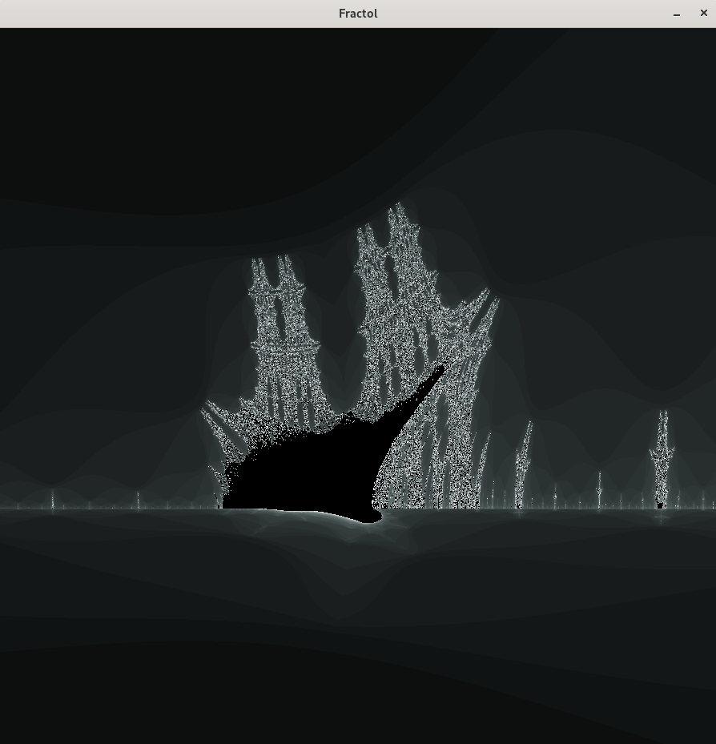
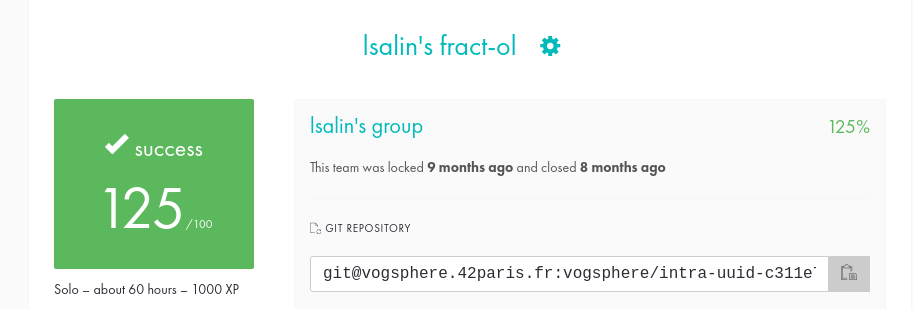

# Fract-ol

🇫🇷

Le but de ce projet est de créer un programme informatique graphique en C reproduisant le comportement des fractales.

Une fractale est un objet géométrique dont la structure est invariante par échelle.  
C'est à dire que si vous zoomez ou dézoomez sur une fractale, vous verrez toujours le même motif répété à l'infini.

L'École 42 a implémenté une bibliothèque graphique en interne, la MiniLibX, qui nous aidera à construire ces fractales.

__Comment tester le programme ?__ (vous devez être sous Linux !)

🇺🇸

# Screenshots

